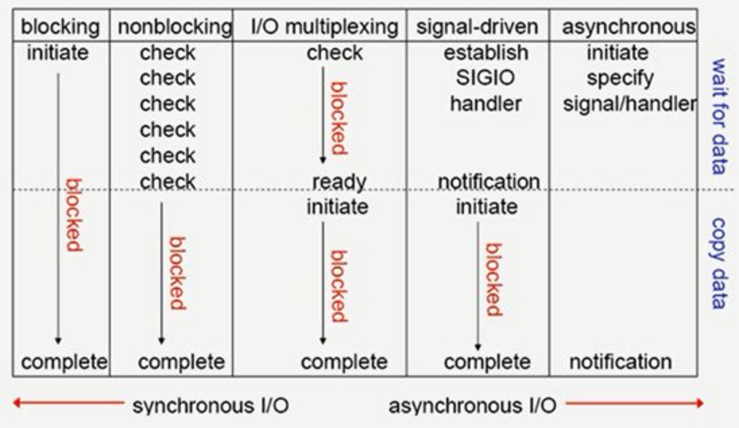

<!-- TOC depthFrom:1 depthTo:6 withLinks:1 updateOnSave:1 orderedList:0 -->

- [要点-五种IO模型](#要点-五种io模型)
	- [总结](#总结)
		- [Blocking I/O(阻塞IO)](#blocking-io阻塞io)
		- [Nonblocking I/O(非阻塞IO)](#nonblocking-io非阻塞io)
		- [IO mutiplexing(select和poll)(IO复用)](#io-mutiplexingselect和pollio复用)
		- [single driven I/O(SIGIO)(信号驱动的IO)](#single-driven-iosigio信号驱动的io)
		- [asynchronous I/O(异步IO)](#asynchronous-io异步io)
	- [END](#end)

<!-- /TOC -->

# 要点-五种IO模型

## 总结

* 首先为什么需要I/O模型呢，因为进程是无法直接操作I/O设备的。其必须通过系统调用请求kernel来协助完成I/O动作。而内核会为每个I/O设维护一个buffer。对于输入而言，等待数据输入到buffer需要时间的，而从buffer复制数据给进程也需要时间的根据等待的模式不同，I/O分为五类。
```
一.Blocking I/O（阻塞IO）
二.Nonblocking I/O(非阻塞IO)
三.IO mutiplexing（select和poll） （IO复用）  
四.single driven I/O （SIGIO）（信号驱动的IO）
五.asynchronous I/O （异步IO）
```




### Blocking I/O(阻塞IO)


### Nonblocking I/O(非阻塞IO)


### IO mutiplexing(select和poll)(IO复用)  


### single driven I/O(SIGIO)(信号驱动的IO)


### asynchronous I/O(异步IO)


## END
